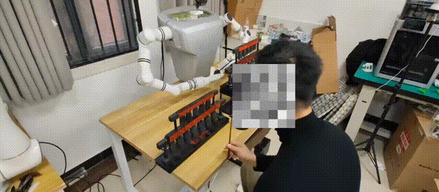
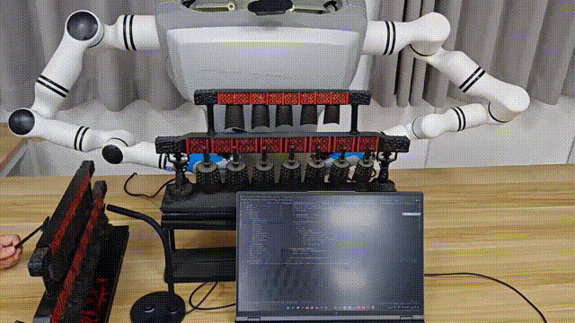
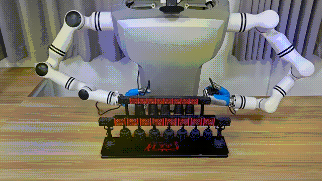

# Co-policy: Responsive Human-Robot Co-Creation for Musical Performances

Co-policy is a modular embodied AI framework for human-robot musical co-creation. The project pairs semantic intent grounding, constrained musical variation, and low-latency visuomotor execution so that a robot can transform an incomplete human musical seed into a complementary, physically executable response.

This repository contains two parts:

- `Real_robot/`: real-robot music co-creation code for Qwen-VL prompting, semantic anchors, constrained planning, and GMP-based chime execution.
- `maniskill2_learn/` and `configs/`: ManiSkill2-based imitation/RL infrastructure used as a secondary visuomotor generalization sanity check.

## Demonstrations

The chime-striking videos with sound are provided in the supplementary materials submitted with the paper.

| Semantic music co-creation |
| :--: |
|  |

| Concerto co-creation |
| :--: |
|  |

| GMP generalization |
| :--: |
|  |

## Paper-Aligned Architecture

1. **Semantic intent grounding**: pre-inference semantic anchors expose style descriptors, technical annotations, and robot-playability tags to Qwen-VL.
2. **Constrained musical variation**: generated notes are constrained by motif retention, novelty, harmony, and reachable chime notes.
3. **Single-pass GMP execution**: the Gaussian-Mixture Visuomotor Policy predicts multimodal six-DoF actions from visual context and target notes in one forward pass.
4. **Latent action modes**: mixture components represent alternative striking postures, approach directions, or contact timing patterns. They do not correspond to individual joints.

The current code preserves backward compatibility with earlier 6D GSA checkpoints, but the paper-level policy is expressed as a conditional mixture-density GMP. Legacy GSA outputs are treated only as deterministic fallback actions when no trained GMP head is available.

## Real-Robot Music Co-Creation

```bash
cd Real_robot
pip install -r requirements_music.txt
python co_policy_main.py
```

Useful files:

- `music_creation.py`: semantic anchors, constrained planner, GMP action policy, and robot performer.
- `semantic_anchors.json`: default anchor bank used by the prompt composer.
- `co_policy_main.py`: interactive speech loop.
- `example_usage.py`: offline component demos.
- `README_Music.md`: detailed real-robot usage notes.

## ManiSkill2 Generalization Check

The ManiSkill2 portion is retained as a secondary visuomotor generalization sanity check, not the central claim of the paper.

```bash
pip install mani-skill2
conda install pytorch==1.11.0 torchvision==0.12.0 cudatoolkit=11.3 -c pytorch
pip install -r requirements.txt
pip install -e .
```

Example BC evaluation command:

```bash
python maniskill2_learn/apis/run_rl.py configs/brl/bc/pointnet_soft_body.py --work-dir {YOUR_DIR} --gpu-ids 0 --cfg-options \
"env_cfg.env_name=Pour-v0" "env_cfg.obs_mode=pointcloud" "env_cfg.n_points=1200" "eval_cfg.num=100" "eval_cfg.save_video=True"
```

## Acoustic and Feedback Limitations

The real-robot pipeline extracts high-level note events from audio. It does not fully solve servo-noise suppression, chime reverberation removal, or tactile/force-based recovery after mis-strikes. These are documented limitations and future work items in the paper.

## Citation

```bibtex
@article{copolicy2026,
  title={Co-policy: Responsive Human-Robot Co-Creation for Musical Performances},
  author={Li, Xuetao and Huang, Wenke and Ye, Mang and Liu, Zijian and Xuan, Jifeng and Li, Miao},
  journal={npj Artificial Intelligence},
  year={2026}
}
```
